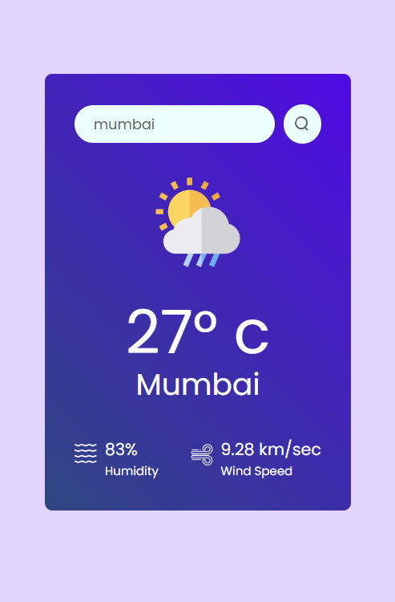

# 🌤️ Weather App

A simple and stylish React-based weather application that fetches real-time weather data using the **OpenWeatherMap API**.



---

## 🚀 Features

- 🌍 Search weather by city name
- 🌡️ Displays temperature, humidity, and wind speed
- 🖼️ Dynamic weather icons based on live data
- 🚨 Gives error for wrong or empty city name
- ⚡ Powered by OpenWeatherMap API

---

## 🛠️ Tech Stack

- **React.js**
- **CSS**
- **OpenWeatherMap API**

---

## 🔧 Installation

1. **Clone the repository:**
   ```bash
   git clone https://github.com/sujoy146/weather-app.git
   cd weather-app
2. Install dependencies:
   npm install
   
3. Set up environment variables:

Create a .env file in the root directory:
  VITE_APP_ID=your_openweathermap_api_key
  
4. Start the development server:
   npm run dev

## 📁 Folder Structure

    weather-app/
    │
    ├── public/
    ├── src/
    │   ├── assets/          # Icons and images
    │   ├── components/
    │   │   └── Weather.jsx  # Main weather component
    │   └── App.jsx
    │   └── main.jsx
    ├── .env                 # (excluded via .gitignore)
    ├── .gitignore
    ├── package.json
    └── README.md
